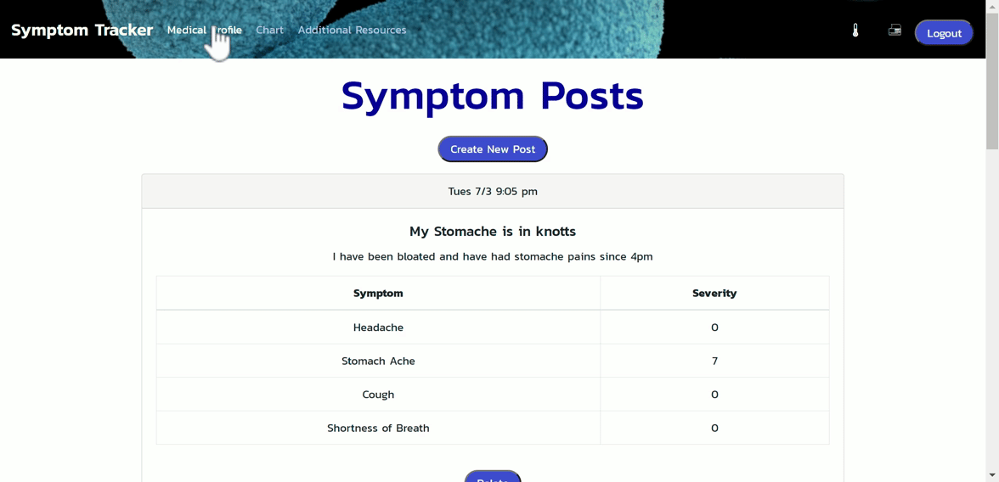

# Symptom Tracker

> Created by:
> - Andrew Knapp - [andrewjknapp](https://github.com/andrewjknapp)
> - Peter Kang - [pswk1](https://github.com/pswk1)
> - Ariel Khawly - [arielkhawly](https://github.com/arielkhawly)
> - Joel Speilberger - [jspielberger](https://github.com/jspeilberger)

## Link to Live Project

[Link to Symptom Tracker](https://nameless-journey-02981.herokuapp.com/)

## Summary

A medical information organization web application. Make private posts to keep track of yours or a loved one's illness.

## Languages and Tech Used

- Javascript
- React.js
- CSS3
- Passport.js
- MongoDB

## Features

- Record symptoms experienced
- View previous symptom entries
- View sympoms in graphical form
- Download symptom information as a pdf

## Live Demo

